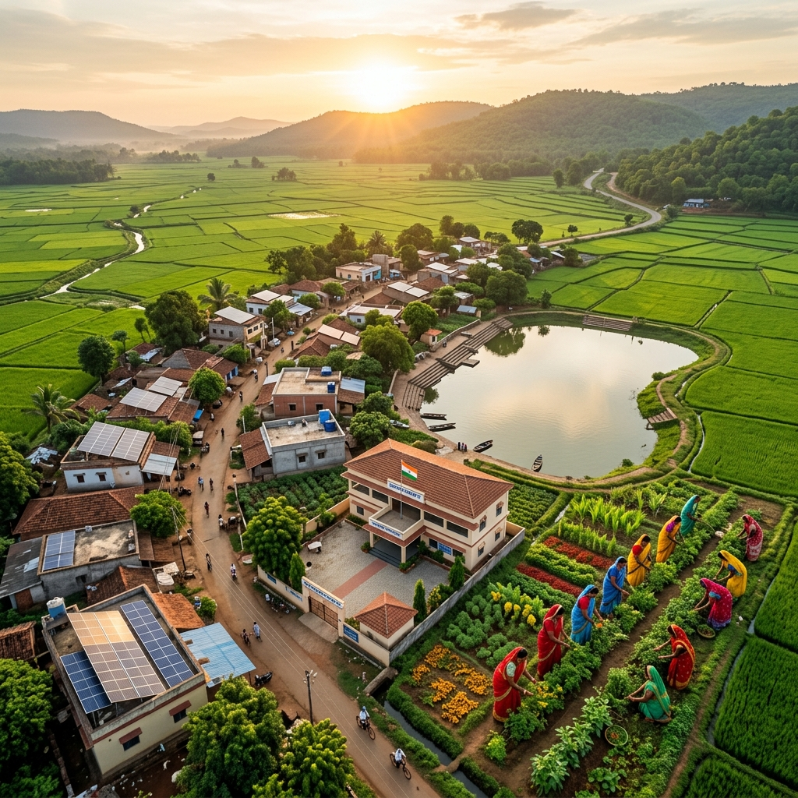

# 🌾 Rural Development AI — Grameen Vikas Portal



> **India's Smart Rural Development Web Portal** — Empowering rural communities through knowledge, technology, and sustainable development.

---

## 🏆 About The Project

**Grameen Vikas AI** is a comprehensive, interactive Rural Development web portal built for **Hackathon 2026**. It serves as a one-stop platform for farmers, students, researchers, NGOs, and government officials to access rural development information, government schemes, and AI-powered guidance.

---

## ✨ Key Features

| Feature | Description |
|:---|:---|
| 🌟 **Hero Dashboard** | Animated statistics — 6.5L villages, 20+ schemes, 83Cr rural people |
| 📰 **Live Ticker** | Real-time scrolling scheme highlights |
| 🏛️ **7 Development Pillars** | Agriculture, Women/SHG, Water, Energy, Health, Digital, Education |
| 📋 **8 Government Schemes** | PM-KISAN, MGNREGA, PMAY-G, Ayushman Bharat, DAY-NRLM & more |
| 🔍 **Scheme Filter** | Filter by Agriculture / Housing / Employment / Women / Energy / Health |
| 📊 **Live Dashboard** | Animated data cards on SHGs, water, electricity, housing, roads |
| 💼 **SHG Project Report** | Complete business plan with pie chart + revenue forecast |
| 🤖 **AI Chat Assistant** | Interactive AI for instant rural development guidance |
| 🌍 **SDG Section** | 12 UN Sustainable Development Goals aligned with rural India |
| 📱 **Fully Responsive** | Works on mobile, tablet, and desktop |

---

## 🌿 Core Topics Covered

- **Agriculture & Modern Farming** — Organic farming, crop rotation, smart irrigation
- **Women Empowerment & SHGs** — Formation, microfinance, business ideas
- **Water Conservation** — Rainwater harvesting, check dams, drip irrigation
- **Renewable Energy** — Solar panels, biogas, PM Kusum scheme
- **Rural Healthcare** — Ayushman Bharat, ASHA workers, sanitation
- **Digital India** — CSCs, BharatNet, digital literacy
- **Rural Education** — Mid-day meals, Skill India, scholarships

---

## 🏛️ Government Schemes Covered

| Scheme | Benefit |
|:---|:---|
| PM-KISAN | ₹6,000/year for farmers |
| MGNREGA | 100 days employment guarantee |
| PMAY-Gramin | Free housing for BPL families |
| Ayushman Bharat | ₹5 lakh health insurance |
| DAY-NRLM | SHG formation & microfinance |
| PM Kusum | 60–90% subsidy on solar pumps |
| PM Fasal Bima | Crop insurance at minimal premium |
| Kisan Credit Card | Low-interest agricultural credit |

---

## 🚀 Getting Started

### Option 1: Open Directly
Just double-click `index.html` in your browser.

### Option 2: Local Server (Recommended)
```bash
# Using Python
python -m http.server 8080

# Then open:
# http://localhost:8080
```

---

## 📁 Project Structure

```
hackathon/
├── index.html       # Main portal page
├── style.css        # Dark-mode glassmorphism styling
├── script.js        # AI chat, charts, animations
├── hero_bg.jpg      # AI-generated hero background
└── README.md        # Project documentation
```

---

## 🛠️ Tech Stack

- **HTML5** — Semantic structure
- **CSS3** — Glassmorphism, animations, responsive design
- **Vanilla JavaScript** — AI chat, Canvas charts, modals
- **Google Fonts** — Outfit font family
- **Font Awesome 6** — Icons
- **Canvas API** — Pie chart & line chart (no external libraries)

---

## 🎨 Design Highlights

- 🌑 **Dark Mode** with glassmorphism effects
- 🎨 **Custom color palette** — Forest green + warm amber
- ✨ **Micro-animations** — Preloader, scroll effects, counters
- 📊 **Custom Canvas Charts** — No Chart.js needed
- 🔮 **Interactive Modals** — Detailed scheme & pillar information

---

## 🌱 SDGs Addressed

This portal directly contributes to:
**SDG 1** (No Poverty) • **SDG 2** (Zero Hunger) • **SDG 3** (Good Health) •
**SDG 4** (Quality Education) • **SDG 5** (Gender Equality) • **SDG 6** (Clean Water) •
**SDG 7** (Clean Energy) • **SDG 8** (Decent Work) • **SDG 11** (Smart Villages) •
**SDG 13** (Climate Action)

---

## 👨‍💻 Developer

**Siddanth** | Hackathon 2026
- 🐙 GitHub: [@Siddanth08](https://github.com/Siddanth08)
- 🌐 Project: [Rural Development AI](https://github.com/Siddanth08/Rural-Development-AI)

---

## 📄 License

This project is open source and available under the [MIT License](LICENSE).

---

<div align="center">
  Made with ❤️ for Rural India 🇮🇳<br/>
  <strong>Grameen Vikas AI — Empowering Villages, Building Futures</strong>
</div>
